# Người Chơi - Hướng Dẫn Sử Dụng

## Giới Thiệu

Người chơi là một khái niệm quan trọng trong trò chơi. Người chơi mặc định đã có các chức năng cơ bản như máu, di chuyển, và ba lô. Bạn có thể tùy chỉnh các chức năng, thuộc tính, ngoại hình hoặc hành động của người chơi thông qua việc chỉnh sửa. Bài viết này sẽ giới thiệu về người chơi từ hai khía cạnh: mô-đun người chơi và script người chơi.
Mô-đun người chơi có thể được cấu hình trước khi trò chơi bắt đầu.
Script người chơi có thể được điều chỉnh trong quá trình trò chơi.

> Người chơi tồn tại dưới dạng một thể hiện của thực thể người chơi trong trò chơi, có nghĩa là các chỉnh sửa trong mô-đun sẽ được áp dụng cho tất cả các thể hiện của thực thể người chơi, trong khi script có thể áp dụng cho "một người chơi cụ thể" hoặc "tất cả người chơi".

## Mô-Đun Người Chơi

Thông qua mô-đun người chơi, bạn có thể thiết lập các thuộc tính của người chơi để người chơi bắt đầu trò chơi trong trạng thái mà bạn mong muốn.
Mô-đun người chơi tương ứng với thực thể người chơi, các chỉnh sửa tại đây sẽ ảnh hưởng đến tất cả các người chơi được tạo ra trong trò chơi.

Trong trình chỉnh sửa, vào menu người chơi trong phần mô-đun:

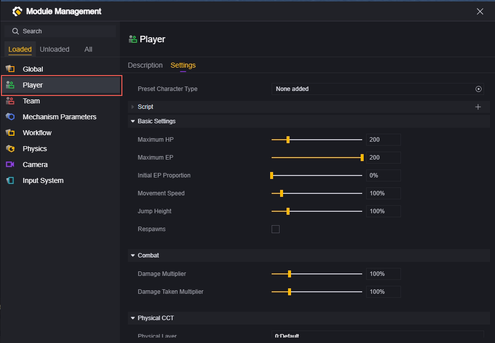

### Loại Người Chơi Mặc Định

Tại đây, bạn có thể sử dụng tài nguyên người chơi tùy chỉnh thay vì sử dụng hình ảnh mặc định. Điều này cho phép bạn thay đổi ngoại hình người chơi và tùy chỉnh một phần hoặc toàn bộ các hành động.

#### Cách Tạo Một Tệp Dữ Liệu Người Chơi:

Trong phần dự án, tạo một tệp dữ liệu người chơi mới:

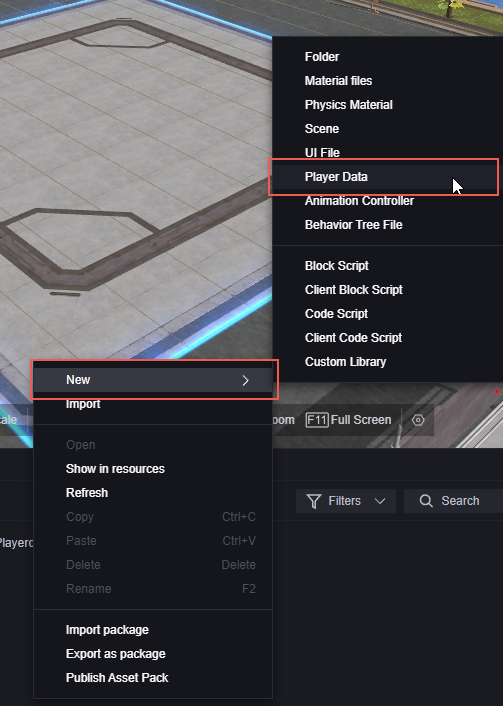

Tệp dữ liệu người chơi chứa mô hình và tài nguyên hành động mà người chơi sẽ sử dụng.

#### Cách Chỉnh Sửa Tệp Dữ Liệu Người Chơi:

Đầu tiên, bạn cần chuẩn bị sẵn các tài nguyên mô hình và hành động cần thiết. Khuyến nghị sử dụng mô hình nhân vật với bộ xương khớp tương thích với mô hình mặc định trong đường dẫn của trình chỉnh sửa cục bộ của bạn \resources\LocalData\Utilities\UGC_Cos_Artist_Rig.

Thêm tài nguyên:

Mô hình nhân vật (ví dụ):

Hành động nhân vật (ví dụ):

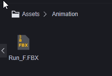

Nhấp đúp vào tệp dữ liệu người chơi mới tạo để mở trang chỉnh sửa:

1. Dữ liệu bộ xương
2. Cửa sổ xem trước
3. Cửa sổ chỉnh sửa

Trước tiên, trong cửa sổ chỉnh sửa (3), bạn cần chọn mô hình nhân vật mà bạn muốn và chọn giới tính.

> Bạn cũng có thể kéo mô hình từ giao diện tài nguyên vào cửa sổ xem trước (2) để nhanh chóng thay đổi mô hình được sử dụng.

Ở đây, chúng tôi sử dụng một mô hình nữ làm ví dụ, vì vậy chúng tôi chọn nữ.

Sau khi thêm mô hình, bạn có thể thấy hình ảnh mô hình trong cửa sổ xem trước (2). Vì đây là một ví dụ, mô hình chỉ là một hình ảnh trắng.

Bạn có thể sử dụng con lăn chuột để phóng to, thu nhỏ và nhấn giữ chuột phải để xoay camera để quan sát chi tiết mô hình.

Ở góc dưới bên trái, thêm hành động mà bạn muốn xem trước trên mô hình này để kiểm tra cách hành động đó hiển thị trên mô hình:

Bây giờ, cửa sổ xem trước hành động bên dưới hiển thị thông tin của hành động đó, nhấp vào phát để xem trước:

Trong phần dữ liệu bộ xương (1), bạn có thể xem cấu trúc xương của mô hình:

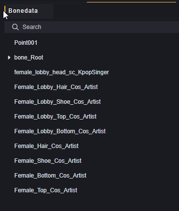

Sau khi chuẩn bị mô hình, bạn có thể thêm các loại hành động cần chỉnh sửa trong cửa sổ chỉnh sửa (3), chẳng hạn như chỉnh sửa hành động chạy, đứng. Các hành động không được chỉnh sửa sẽ phát hoạt cảnh mặc định.

Làm ví dụ, chúng tôi thêm một hành động đứng (idle):

Chỉnh sửa hành động này, khi trò chơi yêu cầu người chơi phát hành động đứng (idle), hành động tùy chỉnh mà bạn đã thêm sẽ được phát.

Để làm ví dụ, chúng tôi sẽ cấu hình hành động chạy thành hành động đứng (idle). Xin lưu ý rằng điều này sẽ dẫn đến hành vi kỳ lạ, khi thực hiện, hãy thêm hành động phù hợp với thiết kế của bạn.

Với các thiết lập này, tệp dữ liệu người chơi này sẽ thực hiện các thay đổi sau:

1. Thay đổi mô hình người chơi thành một mô hình nữ trắng.
2. Thay đổi hành động đứng (idle) thành hành động chạy.

#### Cách Thêm Tệp Dữ Liệu Người Chơi Vào Người Chơi:

Trong phần mô-đun, việc cấu hình sẽ áp dụng tệp dữ liệu người chơi này cho tất cả người chơi:

Biểu hiện trong trò chơi:

> Tất cả mọi người sẽ thực hiện hành động chạy khi lẽ ra họ phải đứng yên (idle), mà không có sự di chuyển thực sự.

Khi thực hiện các hành động khác, hành động mặc định tương ứng với giới tính sẽ vẫn được phát:

> Đây cũng là lý do khuyến nghị sử dụng mô hình với bộ xương mặc định, vì nếu không sửa đổi tất cả các hành động, việc sử dụng bộ xương không đạt tiêu chuẩn sẽ gây ra những biểu hiện rất kỳ lạ khi phát hành động mặc định.

Nếu bạn chỉ muốn thay đổi dữ liệu người chơi cho một người chơi cụ thể, bạn có thể thực hiện điều này bằng cách sử dụng các node script đặc biệt:

Node này có thể thêm dữ liệu người chơi đã chỉ định cho một người chơi cụ thể, có thể được kích hoạt theo yêu cầu của bạn hoặc khi điều kiện thích hợp được thỏa mãn.

#### Cách thêm Texture cho người chơi trong Tệp Dữ liệu Người chơi
Kéo file FBX vào hoạt cảnh để tạo một vật thể.
  
Tạo nhánh mẹ trống
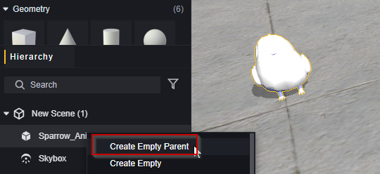  
Tạo một prefab dựa trên nhánh mẹ

Tạo tệp vật liệu mới  
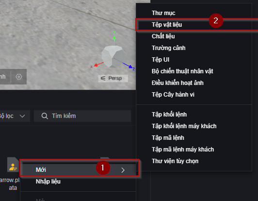  
Chọn loại đổ bóng tùy vào mục đích sử dụng cũng như những texture mà tệp FBX có bao gồm.  
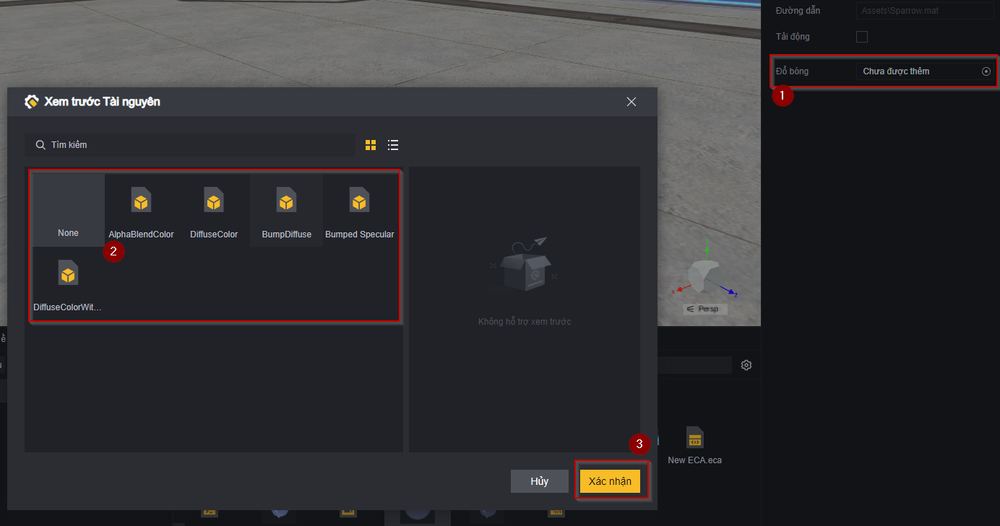  
Thay đổi bản đồ chủ đạo (thường được đính kèm với tệp FBX) và thay đổi các thuộc tính trong tệp vật liệu nếu cần thiết  
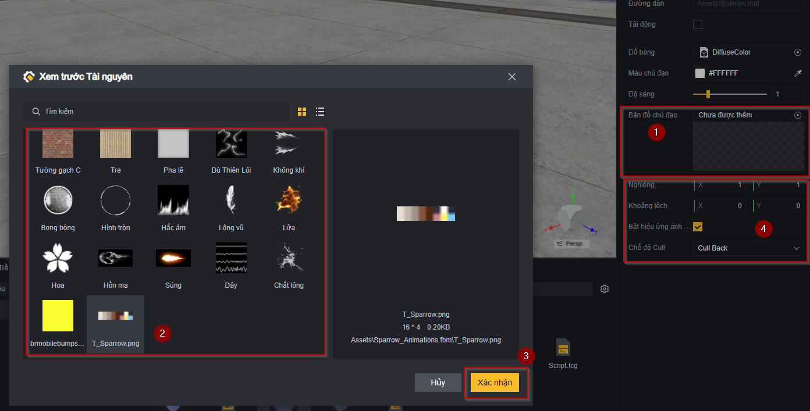
Vào trình điều chỉnh Prefab đã được tạo từ trước, chọn vào nhân vật, và chọn chỉnh sửa ngoại hình.  

> Chú ý cấu trức của nhân vật được thêm vào thông qua tệp FBX có thể chứa nhiều thành phần. Trong trường hợp này có thể làm tương tự bước hiện tại.  

Chọn nhóm ngoại hình, sau đó chọn từng thành phần của ngoại hình và điều chỉnh kết xuất thành vật liệu đã được tạo trước đó.

> Cấu trúc của nhóm ngoại hình có thể khác so với hình mẫu hiện tại

Trong tệp Dữ liệu người chơi, điều chỉnh Lưới Mesh nhân vật trở thành Prefab vừa được tạo và điều chỉnh hành động nhân vật hợp lý bằng các hoạt ảnh được đính kèm với tệp FBX.  
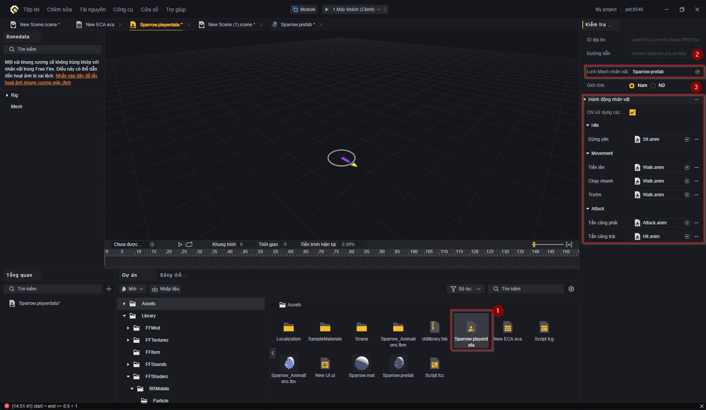

Sau đó thêm tệp Dữ liệu người chơi vào Loại bộ chiến thuật nhân vật để điều chỉnh hoặc sử dụng hàm Đặt nhân vật để điều chỉnh model của nhân vật như trên.
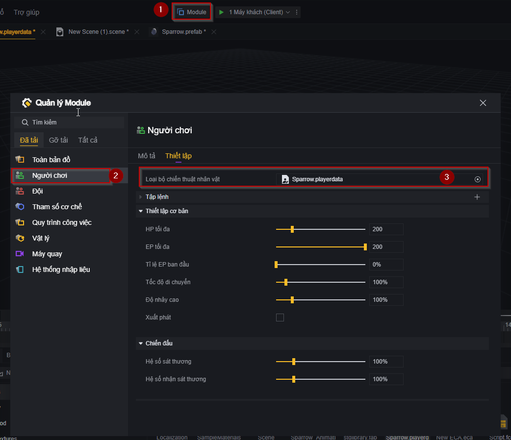

Và kết quả là ...  
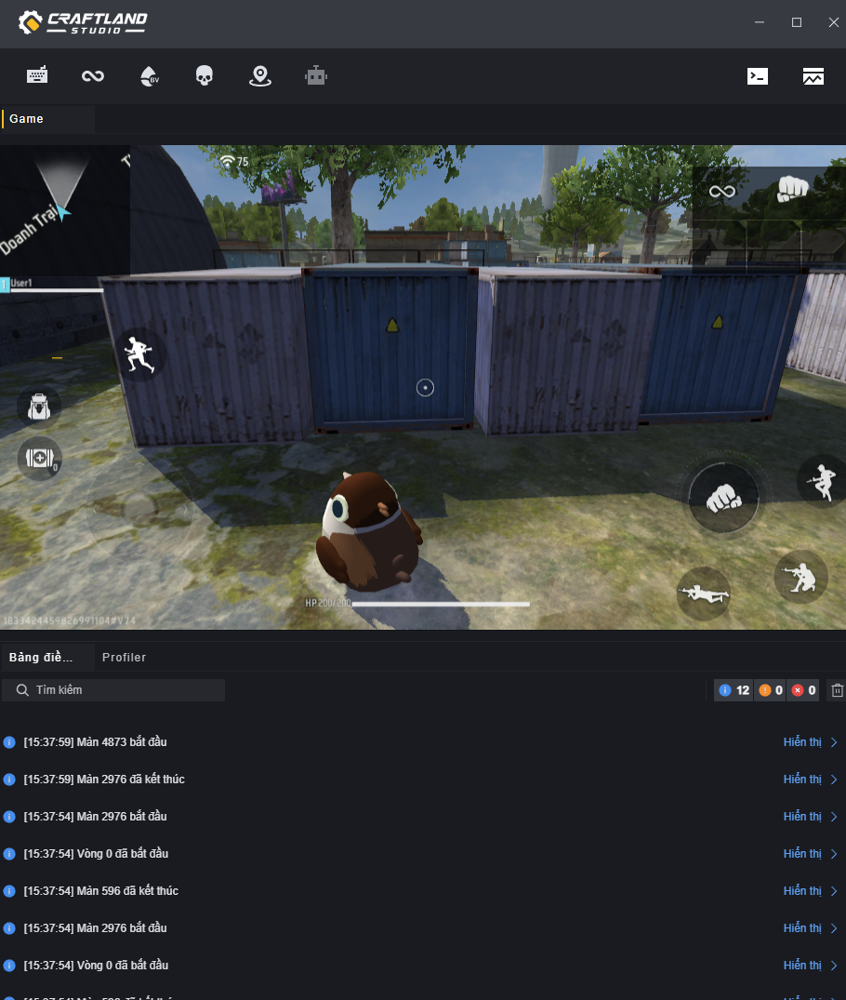

### Script

Bạn có thể gắn script vào thực thể người chơi, khi chạy, script sẽ được gắn vào mỗi người chơi.

Bạn có thể thêm script có sẵn hoặc tạo mới:

Về nội dung script, vui lòng tham khảo phần script người chơi bên dưới.

### Thiết Lập Cơ Bản

Thiết lập các thuộc tính cơ bản của người chơi:

**Giới Hạn Máu:** Giá trị máu tối đa của người chơi, phạm vi từ 20-1000.

**Giới Hạn EP:** Giá trị EP tối đa của người chơi, phạm vi từ 0-200.

**Tỷ Lệ EP Khởi Đầu:** EP ban đầu của người chơi = Tỷ lệ EP khởi đầu * Giới hạn EP, phạm vi từ 0%-100%.

**Tốc Độ Di Chuyển:** Tỷ lệ thu phóng của tốc độ di chuyển, nhỏ hơn 100% sẽ chậm hơn tốc độ mặc định, lớn hơn 100% sẽ nhanh hơn tốc độ mặc định. Phạm vi từ 50%-500%.

**Độ Cao Khi Nhảy:** Tỷ lệ thu phóng của độ cao khi nhảy, nhỏ hơn 100% sẽ thấp hơn độ cao mặc định, lớn hơn 100% sẽ cao hơn độ cao mặc định. Phạm vi từ 10%-500%.

**Hồi Sinh:** Khi được chọn, người chơi sẽ tự động hồi sinh sau khi chết, và một tùy chọn cấu hình thời gian chờ hồi sinh sẽ được thêm mới.

**Thời Gian Chờ Hồi Sinh:** Chỉ xuất hiện khi tùy chọn hồi sinh được chọn. Thời gian chờ hồi sinh sau khi chết, phạm vi từ 0-9999 giây.

> Thay đổi tốc độ di chuyển và độ cao khi nhảy sẽ thay đổi tốc độ di chuyển và độ cao khi nhảy ban đầu của người chơi, các thuộc tính thu phóng tốc độ di chuyển mặc định và thu phóng độ cao khi nhảy của người chơi vẫn là 1. Khi thay đổi các thuộc tính này trong script, các thay đổi sẽ được thực hiện dựa trên cấu hình trong mô-đun.

### Chiến Đấu

Thiết lập các thuộc tính chiến đấu của người chơi:

Tỷ Lệ Sát Thương: Mức độ sát thương gây ra, nhỏ hơn 100% sẽ giảm sát thương mặc định, lớn hơn 100% sẽ tăng sát thương mặc định. Phạm vi từ 0%-500%.

Tỷ Lệ Chịu Sát Thương: Mức độ sát thương nhận vào, nhỏ hơn 100% sẽ giảm sát thương nhận vào, lớn hơn 100% sẽ tăng sát thương nhận vào. Phạm vi từ 0%-500%.

> Tương tự như tốc độ di chuyển và độ cao khi nhảy, thay đổi tỷ lệ sát thương và tỷ lệ chịu sát thương sẽ thay đổi sát thương ban đầu và chịu sát thương của người chơi, các thuộc tính tỷ lệ sát thương mặc định và tỷ lệ chịu sát thương mặc định của người chơi vẫn là 1. Khi thay đổi các thuộc tính này trong script, các thay đổi sẽ được thực hiện dựa trên cấu hình trong mô-đun.

### Bộ Điều Khiển Người Chơi Có Hiệu Ứng Vật Lý

**Cấp Độ Vật Lý:** Quyết định cấp độ vật lý của người chơi, va chạm có xảy ra hay không giữa các cấp độ phụ thuộc vào cấu hình vật lý.

Cấu hình người chơi với một cấp độ vật lý không mặc định:

Trong cấu hình vật lý, tắt va chạm giữa cấp độ Custom và cấp độ mặc định:

Người chơi có thể đi qua bất kỳ vật thể nào có cấp độ vật lý mặc định mà không gặp trở ngại:

Các vật phẩm dựa vào va chạm để kích hoạt cũng sẽ không kích hoạt:

**Có Sử Dụng Bộ Điều Khiển Người Chơi Có Hiệu Ứng Vật Lý:** Khi được chọn, sẽ sử dụng bộ điều khiển với hiệu ứng vật lý tùy chỉnh và mở rộng các cấu hình liên quan.

**Chiều Cao Tổng, Bao Gồm Nửa Hình Cầu Trên Và Dưới:** Chiều cao của hình dạng va chạm dạng viên nang của nhân vật.

**Bán Kính Nửa Hình Cầu Trên Và Dưới:** Bán kính của viên nang, không thể vượt quá một nửa chiều cao.

**Khối Lượng:** Khối lượng của người chơi.

**Góc Dốc Tối Đa:** Dốc có góc độ lớn hơn không thể đi lên được, người chơi sẽ bắt đầu trượt xuống.

**Độ Dịch Chuyển Dọc Khi Bước:** Khoảng cách mà người chơi có thể dịch chuyển mà không bị rời khỏi mặt đất hoặc bị cản trở, thường được sử dụng khi di chuyển trên cầu thang.

**Khoảng Cách Di Chuyển Tối Thiểu:** Nếu khoảng cách mà bộ điều khiển nhân vật cần di chuyển nhỏ hơn giá trị này, người chơi sẽ không di chuyển.

**Độ Dày Của Da:** Độ sâu mà các vật thể khác có thể nhúng vào thể va chạm của nhân vật, được sử dụng để tránh rung lắc hoặc kẹt.

**Gia Tốc Trọng Lực:** Gia tốc trọng lực tác động theo hướng ba chiều. Đối với người chơi, cài đặt này sẽ ghi đè lên cài đặt vật lý toàn cầu.

**Kích Hoạt Lực Đẩy Tùy Chỉnh:** Khi được chọn, lực tác động lên vật thể khi nhân vật đẩy có thể được tùy chỉnh. Khi được chọn, các cấu hình liên quan sẽ được mở rộng.

**Lực Đẩy Tùy Chỉnh:** Lực tác động lên vật thể khi nhân vật đẩy.

**Chiều Cao Nhảy Nhiều Lần:** Chiều cao của mỗi lần nhảy khi nhảy nhiều lần.

**Số Lần Nhảy Tối Đa Khi Nhảy Nhiều Lần:** Số lần nhảy tối đa được hỗ trợ trong mỗi lần nhảy nhiều lần.

**Di Chuyển Trên Không:** Khi được kích hoạt, người chơi có thể thay đổi tốc độ di chuyển và hướng khi ở trên không.

## Script Người Chơi

Các script được gắn vào mô-đun người chơi sẽ được gắn vào mỗi người chơi, lưu ý rằng các sự kiện toàn cục có thể được kích hoạt nhiều lần không phù hợp với thiết kế.

Thông thường, chúng tôi sẽ thao tác trên người chơi và các thành phần của người chơi trong script. Thông qua sự kiện riêng tư, có thể giới hạn phạm vi đối tượng bị kích hoạt:

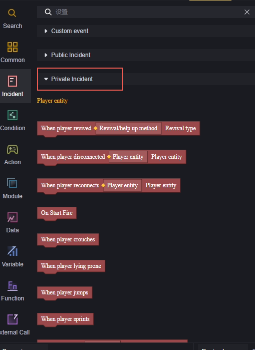

Ví dụ, khi người chơi hồi sinh, cung cấp cho người chơi hồi sinh một khẩu M4A1.

Sự kiện riêng tư "Khi người chơi hồi sinh" chỉ được kích hoạt khi thực thể người chơi hiện tại hồi sinh.

Thêm vật phẩm để thêm một khẩu M4A1 vào thực thể này, thực thể này chính là người chơi vừa hồi sinh, do đó đáp ứng yêu cầu.

> Trong thực tế, cần xem xét vấn đề khi thêm M4A1 nếu vũ khí đã đầy.

Nếu sử dụng sự kiện công khai "Khi người chơi hồi sinh", tất cả người chơi sẽ kích hoạt logic tương ứng mỗi khi một người chơi hồi sinh. Logic tương tự nên được đặt trong script toàn cục.

> Đặt script như thế này trong mô-đun người chơi sẽ khiến tất cả người chơi thêm một khẩu M4A1 mỗi khi có người chơi hồi sinh.

> Đặt script như thế này trong mô-đun người chơi sẽ khiến người chơi hồi sinh thêm số lượng M4A1 tương ứng với số lượng người chơi.